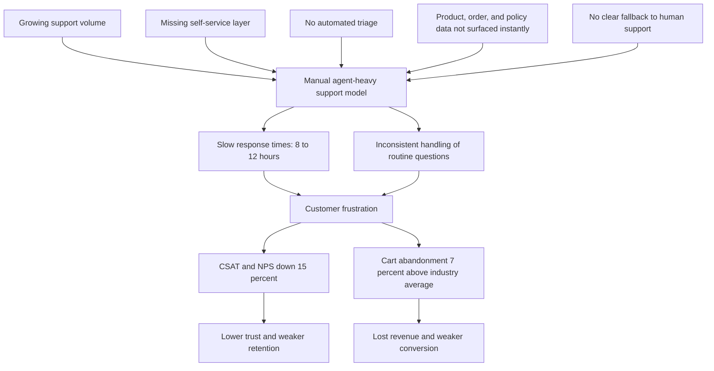
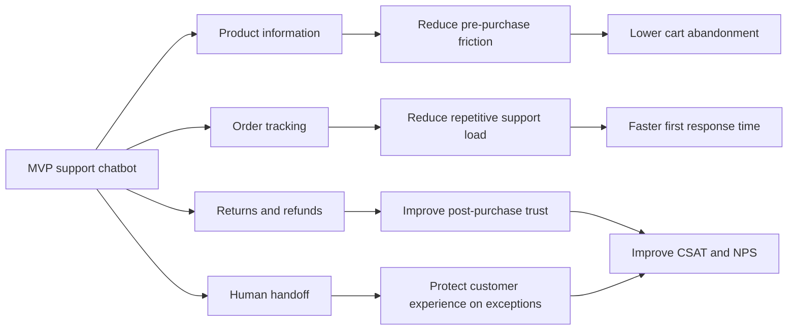
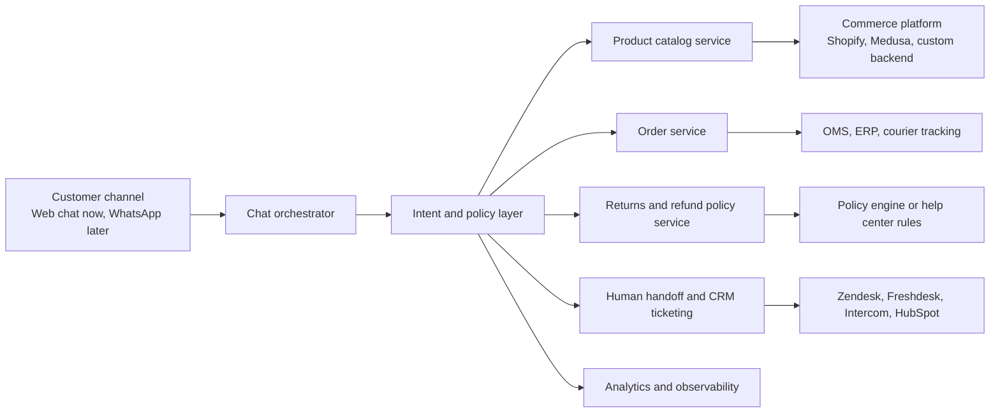
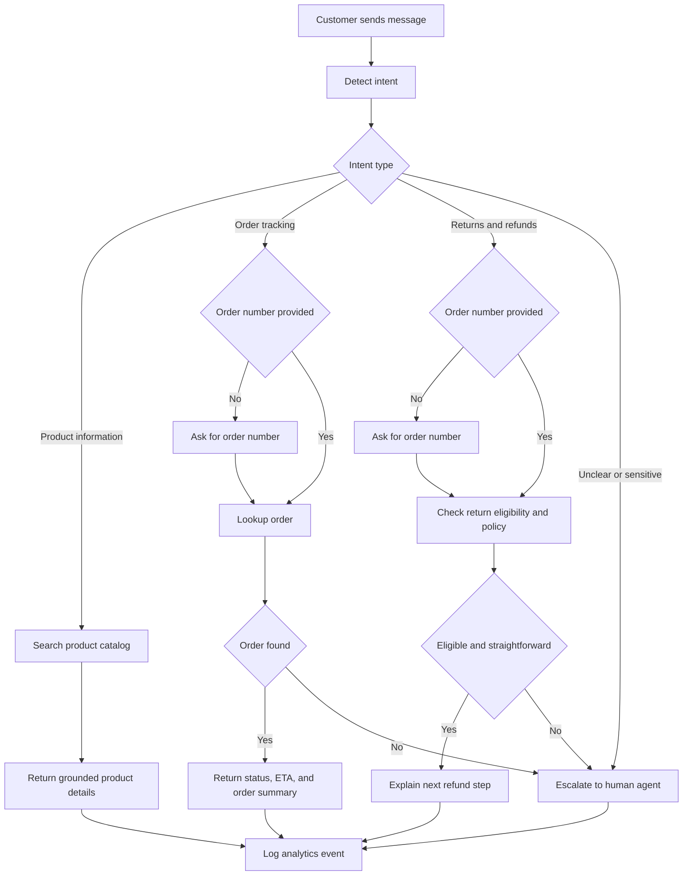
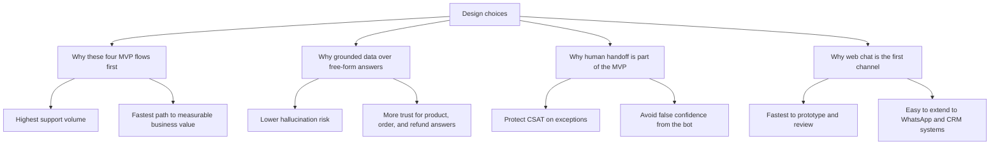
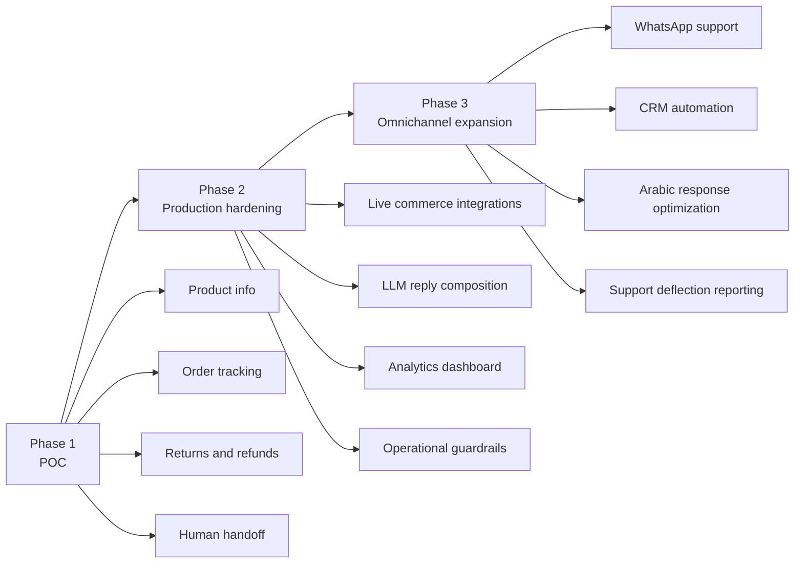

# Mermaid Diagrams Pack

These diagrams are written as clean Mermaid blocks so they can be pasted directly into Mermaid Live or exported as images for the final submission.

Recommended use:

- Problem Definition document:
  - Diagram 1: Problem and impact map
  - Diagram 2: MVP scope and success metrics
- Solution Design document:
  - Diagram 3: System architecture
  - Diagram 4: Core user interaction flow
  - Diagram 5: Design choices and prioritization

## Diagram 1: Problem and impact map

## Diagram 2: MVP scope and success metrics

## Diagram 3: System architecture

## Diagram 4: Core user interaction flow

## Diagram 5: Design choices and prioritization

## Optional Diagram 6: Delivery roadmap

