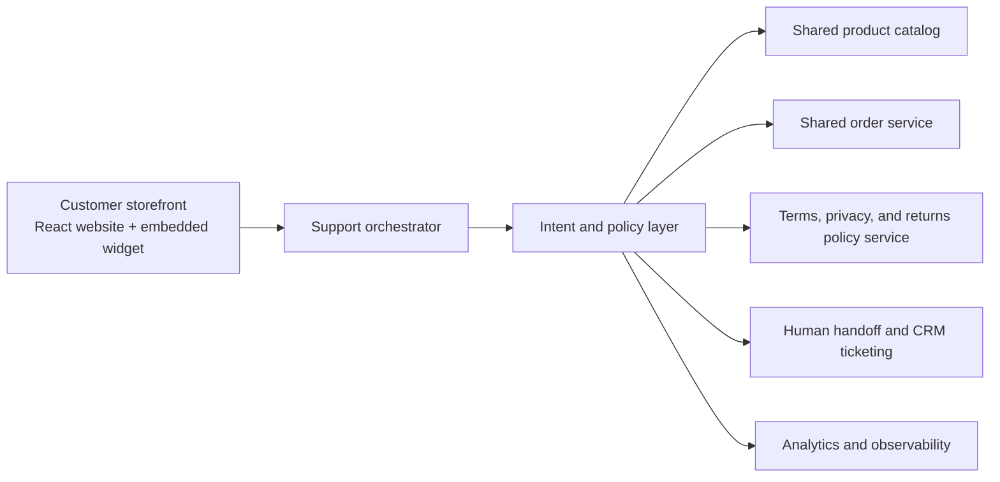
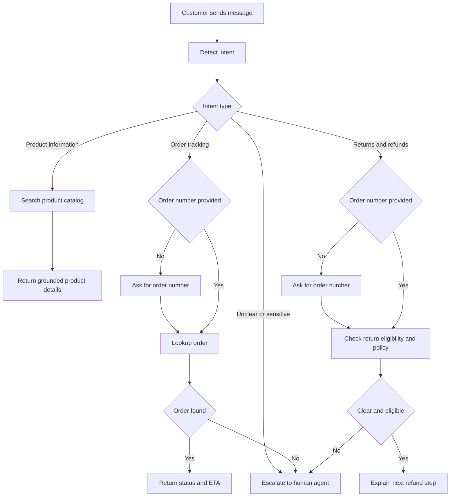

# Solution Design

## Design goal

The goal of this POC is to prove that a focused AI-first support layer can reduce response time for routine inquiries, improve trust, and lower manual support load. I prioritized the smallest set of flows that can create measurable value quickly:

- product information
- order tracking
- returns and refunds
- human handoff

## Architecture

The MVP is implemented as a React storefront with an embedded support widget. A customer can browse products, add items to cart, create a demo order, and ask the assistant for help from the same interface. The support layer detects intent, retrieves trusted business data from shared product, order, and policy sources, and either resolves the request or escalates it to a human agent. This keeps the prototype easy to review while remaining production-friendly in shape.

## Core flow

The assistant first classifies the request, then follows a grounded path for each supported intent. If key information is missing, it asks a clarifying question. If confidence is low or the case is sensitive, it hands off to a human. Product, order, and policy answers are grounded in shared bilingual data used by both the storefront and the chatbot. The returns/refunds, privacy, and terms flows are grounded in the supplied portfolio-company policy documents. See the Appendix for the full core flow diagram.

## Key choices and prioritization

- `Product information` was prioritized because it supports pre-purchase conversion and can reduce cart abandonment.
- `Order tracking` was prioritized because it is one of the highest-volume repetitive support use cases.
- `Returns/refunds` was prioritized because it affects post-purchase trust and satisfaction.
- `Human handoff` was included in the MVP because customer support systems should not guess on sensitive or exception-heavy cases.
- `Shared storefront + support data` was chosen so product details, orders, and policy answers stay consistent across the UI and the chatbot.

## Technology stack

- runtime: Node.js
- server layer: native HTTP server
- UI: ReactJS storefront with an embedded support widget
- data layer: shared bilingual product catalog, dynamic demo orders, and policy-grounded terms/privacy/returns data
- testing: Node built-in test runner
- optional AI layer: OpenAI Responses API for grounded reply composition when credentials are present

## Integration potential

The design can connect cleanly to common commerce and support systems:

- product catalog: Shopify, Medusa, or a custom commerce backend
- order service: OMS, ERP, or courier tracking providers
- policy and legal content: CMS, help center, or policy service with versioned policy documents
- handoff/CRM: Zendesk, Freshdesk, Intercom, HubSpot, or internal tooling
- analytics: BI or product analytics systems for response time, resolution rate, and support deflection

## Guardrails and scalability

- factual answers are grounded in structured business data
- missing information triggers clarifying questions
- low-confidence or sensitive cases escalate to human support
- the architecture is bilingual-ready and can expand to new channels and new policy sources later

Suggested supporting visuals outside the main 1-2 pages: `Diagram 5: Design choices and prioritization` and `Diagram 6: Delivery roadmap` from [mermaid-diagrams.md](/Users/abdullatifeida/abdullatif_eida/new/docs/mermaid-diagrams.md)
