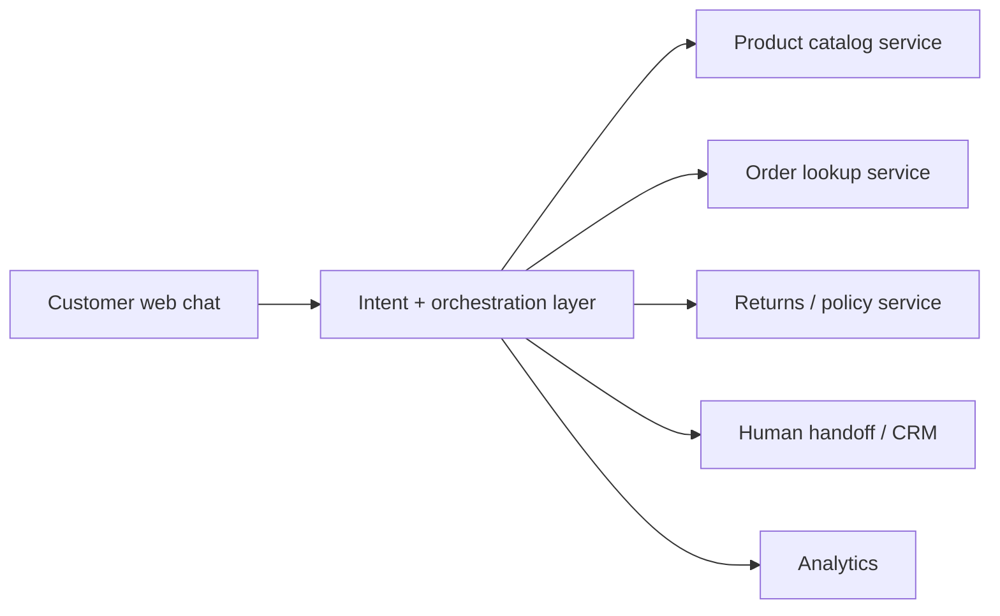
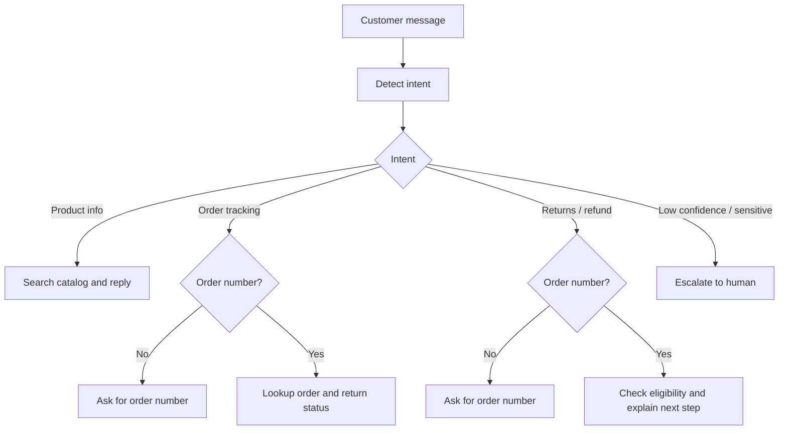

# Solution Design

## Goal

This POC proves that a focused AI-first support layer can reduce response time for routine e-commerce inquiries without trying to replace the support team. I prioritized the smallest MVP that directly addresses the brief:

- `product information` to support conversion and reduce cart abandonment
- `order tracking` to deflect repetitive tickets
- `returns/refunds` to protect trust after purchase
- `human handoff` to safely handle unclear or sensitive cases

## Architecture

The prototype is a React storefront with an embedded support widget. The chatbot sits on top of grounded business services rather than answering from free-form generation alone. This keeps product, order, and policy answers trustworthy and makes the shape easy to integrate later with real commerce and CRM systems.

## Core user flow

The assistant first detects intent, then follows a grounded path. If key information is missing, it asks a clarifying question. If confidence is low, the issue is sensitive, or the order cannot be resolved safely, it escalates to a human agent.

## Key design choices

- `Grounded answers first`: product, order, and refund answers come from structured data, not unsupported generation.
- `Human handoff in MVP`: support systems should not guess on exceptions, complaints, or low-confidence cases.
- `Bilingual-ready`: Arabic and English support matters for KSA operations.
- `Analytics included`: the business needs to measure containment, handoff rate, and response-time improvement.

## Technology stack

- frontend: `React`
- backend: `Node.js` native HTTP server
- data layer: shared mock catalog, order, and policy services
- testing: `Node` built-in test runner
- optional AI layer: `OpenAI Responses API` for grounded reply composition when credentials are available

## Integration potential and scale path

The mock services are designed as replaceable adapters:

- catalog: `Shopify`, `Medusa`, or custom commerce backend
- orders: `OMS`, `ERP`, or courier tracking provider
- handoff: `Zendesk`, `Freshdesk`, `Intercom`, or `HubSpot`
- policy content: CMS or help-center source
- analytics: BI or product analytics tools

This keeps the POC narrow but scalable: it solves the highest-value support journeys now while leaving a clean path to production integrations, WhatsApp expansion, and richer support automation later.
